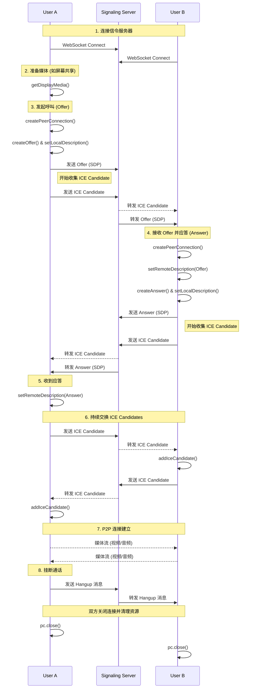

# 部分 5: 总结与展望

## 步骤 5.1: 修复潜在问题并优化代码

### 理论：代码的健壮性与可维护性

在我们之前的实现中，为了聚焦核心流程，我们简化了许多细节。现在，是时候回顾一下代码，找出一些可以优化的地方，让它变得更健壮、更易于维护。主要有以下几个方面：

1.  **硬编码问题 (Hardcoding)**: 目前，WebSocket 信令服务器的地址 (`ws://localhost:8080`) 是直接写在代码里的。在真实应用中，这个地址应该是可配置的，方便部署到不同环境。
2.  **状态管理混乱 (State Management)**: 我们用了一些 `boolean` 类型的状态（如 `localStream`, `remoteStream`, `peerConnection` 是否存在）来控制 UI 的显示和隐藏。当逻辑变得更复杂时，这种方式很容易出错。引入一个更明确的“通话状态机”（比如：`空闲`、`呼叫中`、`通话中`）能让代码更清晰。
3.  **代码结构 (Code Structure)**: `app.tsx` 文件里的代码越来越长，我们可以将一些独立的逻辑（例如 WebSocket 的消息处理、WebRTC 的连接管理）封装成独立的函数或模块，提高代码的可读性和复用性。
4.  **资源释放 (Resource Cleanup)**: 在挂断通话时，我们需要确保所有资源（如 `MediaStream` 的轨道、`RTCPeerConnection`）都被正确关闭和释放，避免内存泄漏或设备占用。

### 核心 API/概念讲解：状态管理与代码组织

1.  **`React.useReducer` Hook**:

    - **是什么**: `useReducer` 是 React 提供的一个用于状态管理的 Hook，通常被认为是 `useState` 的替代方案。它更适合管理包含多个子值的复杂 state 对象，或者下一个 state 依赖于前一个 state 的情况。
    - **为什么用它**: 我们的通话功能有多个相关联的状态（`localStream`, `remoteStream`, `peerConnection`, `callStatus` 等）。将它们合并到一个由 `useReducer` 管理的 state 对象中，可以让状态的更新逻辑更集中、更可预测。

2.  **枚举（`enum`）或常量对象**:

    - **是什么**: TypeScript 中的枚举（`enum`）或者 JavaScript 中的常量对象，可以用来定义一组命名的常量。
    - **为什么用它**: 我们将用它来创建一个**通话状态机**。例如，定义 `CallStatus`，包含 `IDLE` (空闲), `CALLING` (呼叫中), `IN_CALL` (通话中) 等状态。

3.  **函数封装与模块化**:
    - **是什么**: 这是一种编程思想，即将特定功能的代码块提取出来，放到一个独立的函数或模块中，让主组件更简洁，逻辑更清晰。

### 问题排查：React 中的“陈旧闭包” (Stale Closure)

在重构过程中，我们遇到了一个经典问题：在 `useEffect` 的 `onmessage` 回调中，无法获取到最新的 `state`。

- **原因**: `useEffect` 的依赖数组为空 (`[]`)，导致 `onmessage` 回调函数只在组件初次渲染时创建一次，它捕获（闭包）了当时的 `state`（此时 `localStream` 等都为 `null`）。之后 `state` 更新，但回调函数还是旧的，引用的 `state` 也是旧的。
- **解决方案**: 使用 `useRef` 创建一个 `stateRef`。`ref` 对象在组件的整个生命周期内是持久的。我们通过另一个 `useEffect` 在每次 `state` 更新后，都将最新的 `state` 赋值给 `stateRef.current`。这样，在 `onmessage` 等回调中，我们总是可以通过读取 `stateRef.current` 来确保访问到最新的状态。

---

## 步骤 5.2: 全面回顾整个 WebRTC 通信流程

### WebRTC 端到端通信流程图



### 流程详解:

这个过程完美地诠释了 WebRTC 的核心思想：**“信令（Signaling）负责牵线搭桥，ICE（STUN/TURN）负责打通隧道，最终的数据传输由对等方（Peer）自己完成”**。

---

## 步骤 5.3: 教程总结和后续学习方向

### 总结：我们学到了什么？

1.  **核心 API**: 深入实践了 `getDisplayMedia`, `RTCPeerConnection` 和信令。
2.  **关键协议**: 学习了 SDP 的 Offer/Answer 模型和 ICE 的 NAT 穿透机制。
3.  **完整流程**: 串联起了从呼叫、协商、连接到挂断的完整生命周期。
4.  **工程实践**: 学习了用 `useReducer` 进行状态管理和如何解决“陈旧闭包”问题。

### 展望：下一步学什么？

1.  **RTCDataChannel (数据通道)**: 用于在浏览器间建立低延迟的任意数据传输通道，可用于游戏、文件传输、协同编辑等。
2.  **多人通话 (MCU / SFU)**:
    - **MCU (Multipoint Conferencing Unit)**: 服务器混合多路流为一路，客户端压力小，服务器压力大。
    - **SFU (Selective Forwarding Unit)**: 服务器仅转发流，是目前更主流的方案，有 `mediasoup`, `Janus` 等优秀开源项目。
3.  **完善用户体验 (UX)**: 如网络状态提示、设备切换、更美观的 UI 等。

---

## 深入问答: `RTCDataChannel`

### Q1: `RTCDataChannel` 是否必须依赖媒体流？可以创建纯数据通道的连接吗？

**A1: 完全可以，`RTCDataChannel` 不需要依赖任何媒体流。**

可以创建一个纯数据的 `RTCPeerConnection`。整个 Offer/Answer 和 ICE 协商流程完全一样，只是 SDP 中不包含 `m=video` 或 `m=audio` 的媒体描述，只包含 `m=application` 的数据通道描述。`RTCPeerConnection` 依然会负责打通 P2P 隧道，只是隧道里跑的不再是音视频数据，而是 `RTCDataChannel` 的数据。

### Q2: `RTCDataChannel` 是点对点的，如何用于在线游戏、协同编辑等多用户场景？

**A2: 通过在多个 P2P 连接之上构建一个网络拓扑（Topology）。**

主要有两种架构：

**1. 网状网络 (Mesh Topology)**

每个用户都与其他所有用户建立一个直接的 `RTCPeerConnection` 连接。

```mermaid
graph TD;
    subgraph Mesh Network (每个节点直连所有其他节点);
        A --- B;
        A --- C;
        A --- D;
        B --- C;
        B --- D;
        C --- D;
    end
```

- **优点**: 完全去中心化，延迟极低。
- **缺点**: **扩展性极差**。随着人数增加，每个客户端需要维护的连接数和消耗的资源会急剧上升。

**2. 星型网络 (Star Topology) - 通过 SFU 服务器**

所有用户都只连接到一个中心的 SFU (Selective Forwarding Unit) 服务器。

```mermaid
graph TD;
    subgraph Star Network (通过中心 SFU 转发);
        A -- P2P Connection --> SFU;
        B -- P2P Connection --> SFU;
        C -- P2P Connection --> SFU;
        D -- P2P Connection --> SFU;
        SFU -- Forwards Data --> A;
        SFU -- Forwards Data --> B;
        SFU -- Forwards Data --> C;
        SFU -- Forwards Data --> D;
    end
```

- **优点**: **扩展性极好**，客户端压力恒定。是目前业界最主流的方案。
- **缺点**: 需要服务器成本，并增加一次网络中转的延迟。
